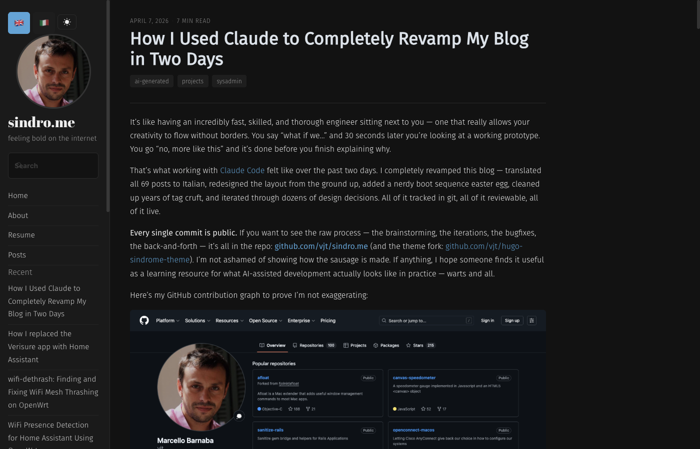
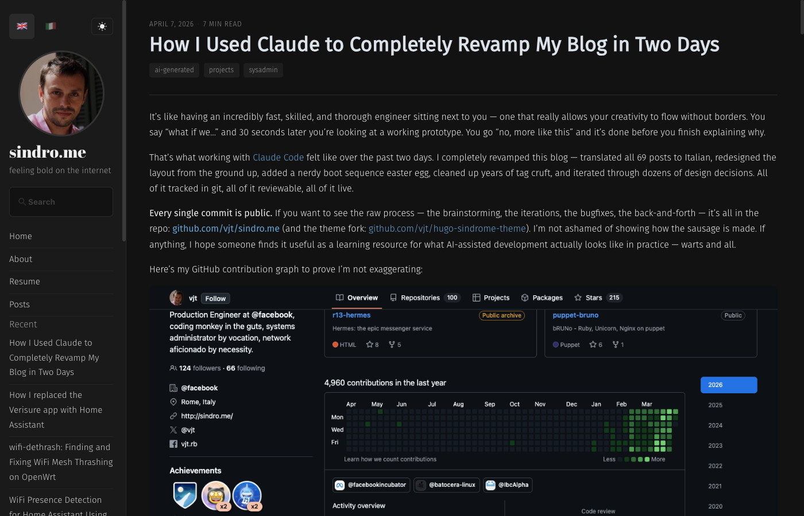
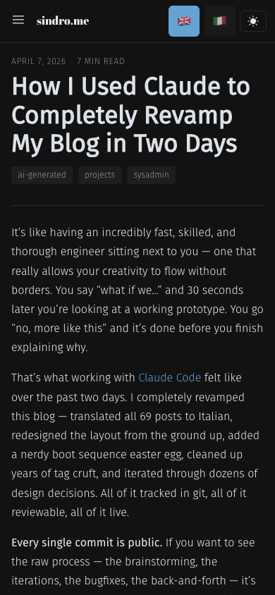

# Sindrome

A modern, bilingual Hugo theme with CSS Grid layout, system-aware dark mode, and a couple of easter eggs. Powers [sindro.me](https://sindro.me).

Forked from [Poison](https://github.com/lukeorth/poison) by Luke Orth, which was based on [Hyde](https://github.com/mdo/hyde) by mdo.

### Desktop (light)


### Desktop (dark)


### Mobile (light / dark)
 

## Live

- **Production**: [sindro.me](https://sindro.me)
- **How it was built**: [How I Used Claude to Completely Revamp My Blog in Two Days](https://sindro.me/posts/2026-04-07-how-i-used-claude-to-revamp-my-blog/)

## What changed from Poison

Pretty much everything except the general idea of "sidebar + content blog."

### Layout
- **CSS Grid** replaces the old Hyde/Poole flexbox layout
- **Three-column desktop**: sidebar (220px) | content (fluid, max 52rem) | table of contents (200px)
- **Hamburger menu** below 1200px with slide-out sidebar, overlay, focus trap
- **Collapsible TOC** on tablet/phone, full static TOC on desktop
- **Responsive breakpoints**: 1200px (desktop), 600px (phone)
- Old `poole.css` + `hyde.css` + `poison.css` + `custom.css` replaced by `layout.css` + `components.css` + `codeblock.css`
- **Post list sidebar** on index pages — right sidebar shows posts on the current page with dates and prev/next navigation

### Visual
- **Light-first design** with system-aware dark mode (`prefers-color-scheme`)
- **No-FOUC**: inline script in `<head>` applies dark class before first paint
- Newspaper-style post headers (meta above title)
- Category pills, tag pills
- Post navigation as bordered cards
- Bigger language switcher tap targets (44px minimum, WCAG)

### Features
- **Full i18n** — English + Italian out of the box, language switcher with flag emojis (see `i18n-nginx.conf.sample` for the server-side Accept-Language + cookie redirect config)
- **Boot sequence splash** — Linux kernel boot animation on first visit (`sessionStorage`)
- **Console easter egg** — hacker emblem (glider) rendered as inline SVG when you open devtools
- **Vintage banner** — auto-generated disclaimer for posts older than 10 years, disable per-post with `hideVintage: true`
- **Retrospective shortcode** — `...` for adding modern context to old posts
- **Copy-to-clipboard** on code blocks — hover-only icon, positioned outside code flow
- **Resume pipeline** — markdown to web page + PDF (via WeasyPrint)
- **Pagefind** search integration
- **Remark42** comments with cross-language thread sharing (Disqus fallback available)
- Theme syncs dark/light mode with Remark42
- **Custom Remark42 CSS** — `static/remark42/remark-sindrome.css` overrides Remark42's default colors/fonts to match the theme. Served via nginx — see `remark42-nginx.conf.sample` for deployment
- **`remark42_url`** — optional config param to set the canonical origin for comment threads (useful for staging environments)

### Removed
- KaTeX (math rendering) — dead weight
- Tabs shortcode — no CSS, no usage

## Requirements

- Hugo extended (v0.101.0+)
- For resume PDFs: Python 3 + WeasyPrint

## Installation

```bash
git submodule add https://github.com/vjt/hugo-sindrome-theme.git themes/sindrome
```

In `config.toml`:
```toml
theme = "sindrome"
```

## Configuration

See [sindro.me's config.toml](https://github.com/vjt/sindro.me/blob/master/config.toml) for a complete working example.

## Credits

- [Poison](https://github.com/lukeorth/poison) by Luke Orth — the original theme this was forked from
- [Hyde](https://github.com/mdo/hyde) by mdo — the OG sidebar layout
- Built with aggressive assistance from [Claude Code](https://claude.ai/code) by Anthropic

## License

GPL-3.0 — same as the original Poison theme.
